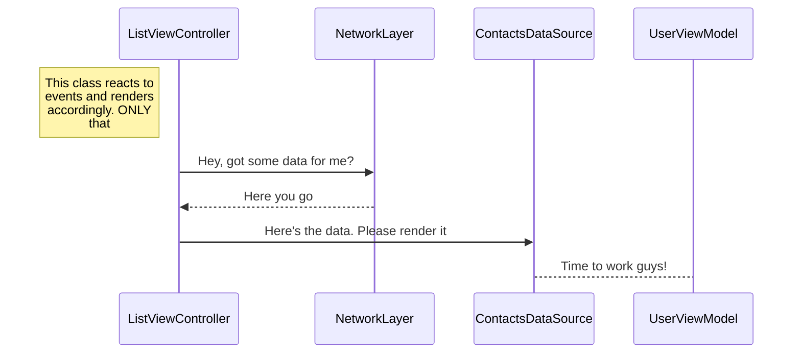

# Code challengue
Solstice code challenge for recruiting at iOS positions.
You can find the requirements of this exercise in the [pdf]("https://github.com/mchirino89/codeChallengue/blob/master/ProgrammingChallengeMobile.pdf") placed at the root of the repo.

# Technologies

Some frameworks were included in this project in order to speed up the process: 

* [Cocoapods](https://cocoapods.org/)
* [Alamofire](https://github.com/Alamofire/Alamofire)
* [AlamofireImage](https://github.com/Alamofire/AlamofireImage)

Instalation process is straight forward: first install _Cocoapods_ using the terminal by executing:
```
$ sudo gem install cocoapods
```

After the project has been cloned, proceed to open a terminal on the root folder and run 
```
$ pod install
```
And that's it. Everything should run smoothly.

# Reasoning

- MVVM and SOLID were at the heart of this development, always favoring composition over inherence (that's why you can see so many files for such a "small" project). It was _lego oriented_ design 😁
- Little example of how the first view behaves ([Mermaid](https://mermaidjs.github.io/) is required In order to properly show it)


- Cache policy is simple: if the response is successful store it, otherwise use placeholder image from now on.
- Use of StackViews wherever possible to laverage its flexibility and layout power.

# Considerations 

There were tradeoffs in every major design decision behind the development. While it is true that SOLID principles are at the core of every choice made here, no peace of software is ever complete so there might be minor duplicated here and there for speeding sake. Some notes can be found across the project explaining the shortcomings of those implementations.

# Things to improve
You might find odd for me to include this section since it looks like I'm sabotaging myself. The intention here is to acknowledge the things that, most likely due to lack of time, remain pending. Just to mention a few:
- Implement _coordinators_ instead of instantiating and pushing details view controllers from main list controller.
- Add unit testing
- Remove minor duplications on image network calls and cell dequeuing 
- Abstract hardcoded strings into plist or centralized struct for instance.
# Final notes
Hope I made myself clear in all of my intents. Looking forward to any feedback! 

Regards.